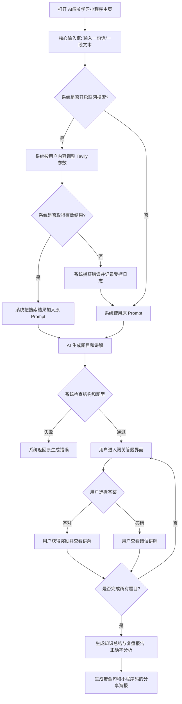

# 《AI 闯关学习小程序》需求分析文档

本文档在 2026 年 10 月 3 日对齐【优化 AI 生成题目】和异步出题任务需求。小程序通过创建任务与轮询取得题库。联网搜索属于可选增强：搜索成功时系统把结果加入 Prompt，搜索失败时系统记录错误并用原 Prompt 照常出题。联网开发验收记录见 `docs/联网搜索开发验收.md`。

### 人工需求分析

核心功能 MVP（按照用户操作的核心业务流程设计）：

1）用户可以自由输入一个他想学的知识（可以是一句话、一段话、甚至是一个文档 / 一个视频 / 一个网页）

2）系统按 enable_web_search 开关决定是否搜索。系统根据用户内容调整 Tavily 参数，并在成功时提供出题参考。文档和视频解析仍属于后续扩展。

3）AI 生成题目、选项、答案和讲解。系统搜索失败或关闭时使用原 Prompt，系统继续检查题量、题型、JSON 和答案结构。

4）用户可以自由答题闯关，每道题目选择后立刻给出正确答案和知识讲解（答错也有知识讲解）

5）通关之后会生成一个知识总结和复盘报告，用户可以分享给好友

6）用户可以在后台分析自己所学的知识和答题情况，便于日后复盘，还可以生成报告

---

以下是需求分析文档正文：

### 1. 需求背景

- **核心痛点：** 现代学习者面临“信息过载”与“学习动力不足”的双重痛点。
- **出题质量问题：** 模型的已有知识可能没有覆盖新概念。模型也可能把同名术语理解为其他领域。系统需要分别解决资料缺失和主题理解错误，不能只修改输出格式。
- **解决方案：** 利用 AI 将非结构化的海量信息（文档、视频、网页）瞬间转化为结构化、趣味性的问答游戏。
- **产品定位：** 深度集成于微信生态的学习小程序，主打“万物皆可闯关”。
- **核心壁垒：** 核心竞争力在于对用户学习流程的“游戏化再造”以及基于微信生态的社交裂变能力。

------

### 2. MVP 最小可行功能点

前期的目标是让用户跑通“输入 -> 答题 -> 总结报告”的极简闭环，确保产品轻量且开发周期极短。

- **单点知识导入：** 主页仅保留一个干净的输入框，用户可以自由输入一个他想学的知识（比如一句话、一段核心概念）。
- **AI 引擎自动出题：** 系统生成单选题、多选题、判断题和讲解。系统开启搜索且取得有效结果时，会将结果注入 Prompt，帮助模型理解新知识。
- **联网开关与动态搜索：** 系统提供后端总开关和用户本次搜索选项。系统按用户主题调整搜索领域、深度、结果数量和明确时间窗口。用户可以在输入中说明领域和版本。
- **搜索失败处理：** 系统捕获错误、记录受控日志，并使用原 Prompt 照常出题。系统不把搜索错误作为学习内容，也不把回退题库称为已经联网核实。
- **核心游戏化机制：** 引入“经验值”系统，答错会扣除/影响经验值获取。每关通过后，给予用户虚拟金币、经验值 (XP) 的即时奖励。
- **个人复盘与社交分享：** 通关后利用 AI 生成包含本次学习正确率、知识总结和掌握度百分比的复盘报告，便于日后复盘。支持生成一张包含学习金句及小程序码的精美海报供分享。

------

### 3. 后续扩展功能点 (按优先级排序) 

| **优先级**        | **功能模块**           | **详细说明**                                                 |
| ----------------- | ---------------------- | ------------------------------------------------------------ |
| **P1 (输入扩展)** | **多格式源信息解析**   | 支持上传 PDF/Word 文档、输入网页 URL 或视频链接，AI 自动解析全文并生成题库。 |
| **P1 (深度进阶)** | **RAG 私有知识库**     | 支持用户创建并管理多个私有文件夹，用于企业考核或考试真题模拟。 |
| **P1 (用户留存)** | **后台错题与分析复盘** | 结合艾宾浩斯遗忘曲线监控答错的题目，在特定天数自动触发“旧识重温”宝藏关卡。提供用户后台图表分析分析答题情况。 |
| **P2 (社交裂变)** | **社交对战与排行榜**   | 支持邀请微信好友进行双人 PK，并设立按知识领域划分的全服排行榜。 |
| **P2 (体验增强)** | **多模态生图与交互**   | 前期仅做文本，后期针对题目自动生成示意图片，或支持数字人播报、语音对答 `[todo 确认: 明确前期纯文本，后期多模态]`。 |
| **P3 (商业闭环)** | **多元化付费模型**     | 推出基础 VIP 订阅、高级 AI 解析包，以及针对超大文档的按量付费和 B2B 定制套餐。 |

------

### 4. 用户操作的具体流程图

代码段



------

### 5. 需求功能核对清单

#### 【P0】核心 MVP 阶段 (跑通一句话出题闭环)

- **基础与 AI 对接：**
  - [ ] 申请并配置后端服务器与微信小程序开发者账号。
  - [ ] 系统实现 enable_web_search 开关和基于用户内容的 Tavily 参数策略。
  - [ ] 系统在搜索成功时将清洗后的结果注入原 Prompt。
  - [ ] 系统在搜索失败时捕获错误、记日志，并用原 Prompt 出题。
  - [ ] 系统保留原题目结构检查，并记录实际搜索状态和参考来源。
  - [ ] 落实敏感词过滤机制，确保生成的题目及解析合规。
- **前端界面开发：**
  - [ ] **极简主页：** 页面保留学习输入和“开始生成”按钮，并增加本次“联网补充资料”选项。
  - [ ] **闯关页：** 题目展示、选项点击逻辑，以及“经验值” UI 展示。
  - [ ] **反馈交互：** 用户提交答案后可以查看正确答案和讲解。系统使用联网参考时，会在当前学习记录完成后的复盘或历史详情中展示实际来源；系统在完成前隐藏可能透露后续答案的内容与链接。
  - [ ] **报告与分享页：** 展示生成的知识总结、正确率，并利用 Canvas 拼接生成无排名的金句分享海报。
  - [ ] **微信生态：** 实现微信授权登录机制获取用户信息，支持海报一键保存或转发。

#### 【P1】功能扩展阶段 (输入源拓宽与留存)

- [ ] **多源输入：** 接入文本抓取 API 及基础文档（PDF/Word）解析接口。
- [ ] **个人中心分析：** 开发用户后台，统计历史答题情况与所学知识树，生成深度复盘报告。
- [ ] **RAG 支持：** 构建向量数据库，允许输入私有知识库来生成题目。

#### 【P2-P3】高级玩法阶段 (多模态与商业化)

- [ ] **多模态 AI：** 接入 AI 绘图/语音能力，应用到题目和选项中。
- [ ] **社交与盈利：** 开发多人对战 PK、排行榜系统，以及 VIP 充值盈利系统

------

### 6. 【P0】优化 AI 生成题目

#### 6.1 用户问题与目标

模型的已有知识可能缺少新概念，也可能把同名术语理解成其他领域。用户输入 `HarnessEngineering` 时，需要让模型获得相关参考内容。联网搜索可以改善资料不足，但搜索结果和生成题目仍可能出错。

在 AI 编程领域，Harness Engineering 的一个实际用法涉及为编程智能体设计工作环境、说明目标和建立反馈流程。原始文章可以作为该含义的参考，系统不能把这一含义写成所有领域通用的唯一解释。（Lopopolo）

本次需求优先保证出题流程可用。系统搜索成功时把结果加入 Prompt；系统搜索失败时捕获错误、记录日志，不加入搜索结果，并使用原 Prompt 照常出题。系统不强制要求用户先确认领域或补充材料。

#### 6.2 联网开关

后端配置属性为 `enable_web_search`，环境变量为 `ENABLE_WEB_SEARCH`，默认值为 true。后端优先读取 `TAVILYSEARCH_API_KEY`，并兼容 `TAVILY_API_KEY`。生成请求支持同名可选字段，用户关闭时发送 false，省略或 null 时继承后端设置。

后端关闭是总限制。用户不能通过请求强行打开后端已关闭的搜索。开关关闭时，系统不初始化 Tavily，不读取密钥，也不发生外部搜索。系统使用原 Prompt。

前端提供“联网补充资料”选项。界面根据后端实际响应显示是否使用搜索结果，不能仅根据用户选项判断已联网。

#### 6.3 正常出题与失败回退

1. 用户提交主题后，系统先检查内容和有效开关。
2. 系统开启搜索时，根据用户内容调整参数，并调用 LangChain TavilySearch。
3. 系统取得有效结果后，清洗、去重、限制长度，并把结果加入原 Prompt 的参考资料区域。
4. 系统搜索超时、限流、密钥错误、配额耗尽、返回空结果或其他增强错误时，记录受控日志，并使用不含搜索资料的原 Prompt。
5. 系统继续执行原有 JSON、题量、题型和答案结构检查。搜索失败本身不阻止成功题库保存或学习记录创建。
6. 系统创建任务前拒绝不合格输入。后台遇到模型失败、结构不合格或存储失败时，系统将任务记为失败。
7. 用户离开页面或停止查询后，已创建的任务继续执行。后台任务超时或工作协程关闭后，系统停止处理，不继续兜底生成。旧同步接口保留断开后取消生成的行为。

#### 6.4 动态参数要求

系统按内容选择 general、news 或 finance。系统对基础知识使用 basic，对新术语、版本问题和复杂主题使用 advanced。系统按内容控制最多 5 或 8 个结果，并保留用户明确的领域和版本。

用户指定最近一周、一个月或一年时，系统分别使用 week、month 或 year。用户只说“最新”时，系统不擅自增加硬时间过滤。用户明确指定站点时，系统只使用经过校验的公开域名。系统无法分类时使用通用参数，参数处理失败时使用原 Prompt。

系统必须限制参数值、查询长度、上下文长度和真实调用次数。系统不能直接执行用户文本中的工具设置。系统只发送最少必要的主题信息，不能直接把用户输入全文发送到搜索服务。

#### 6.5 超时、日志与状态

后台搜索和模型生成预算默认为 55 秒，后台任务执行时限为 90 秒。前端创建和查询任务的单次请求时限为 15 秒，前端每 5 秒查询一次。系统搜索前会为原模型保留正常调用时间，默认 45 秒，因此默认配置下搜索可用时间至多约 10 秒。首次搜索初始上限为 10 秒，第二次搜索为 5 秒，搜索阶段总预算为 20 秒。系统最多重试一次，并为原模型链保留正常运行时间。系统在没有预算、搜索排队超时或熔断开启时直接用原 Prompt。

系统记录搜索失败类型、耗时、调用次数和最终 Prompt 路径。日志不能包含密钥、用户输入全文、完整查询或上游错误全文。日志写入失败也不能阻止回退出题。

系统成功响应可以包含 `web_search` 元信息。其状态分为 success、fallback 和 disabled，并用 `context_used` 说明是否实际加入资料。搜索失败但原模型成功时，题库仍是成功生成。用户会看到“系统本次未使用联网资料，题目由模型已有知识生成”。

用户可以发送以下请求。系统在响应的 `web_search` 中返回真实状态；登录入口在学习记录完成前将 `sources` 投影为空列表。

```json
{"user_input":"HarnessEngineering，AI 编程领域","enable_web_search":true}
```

#### 6.6 验收样例

| 场景 | 系统应有的行为 |
| --- | --- |
| 用户和后端都允许搜索，Tavily 返回有效结果 | 系统注入结果，并返回 success 与 context_used=true。 |
| 后端关闭，用户请求开启 | 系统不初始化 Tavily，外部调用次数为 0，用原 Prompt。 |
| 用户关闭本次搜索 | 系统不搜索，用原 Prompt。 |
| 旧客户端没有发送开关 | 系统继承后端设置，并保留原请求兼容性。 |
| 搜索最终超时 | 系统捕获错误并记日志，使用原 Prompt，不返回搜索业务错误。 |
| 密钥错误、配额耗尽或限流等待超预算 | 系统停止搜索尝试，记录原因，并使用原 Prompt。 |
| 搜索返回空结果、错误文本或参数处理失败 | 系统不注入结果，使用原 Prompt。 |
| 搜索失败但日志平台也不可用 | 系统仍用原 Prompt 出题。 |
| 搜索失败且原模型也失败 | 系统返回原生成错误。 |
| 用户请求最近一个月的新闻事件 | 系统实际发送 news 与 month 等受限参数。 |
| 用户只说最新技术概念 | 系统保留通用技术领域，不擅自增加新闻领域或硬时间窗口。 |
| 两个并发请求使用不同参数 | 系统不会把一个请求的参数写入另一个请求。 |
| 用户离开异步任务页面 | 系统继续处理已创建的任务，前端停止查询。 |
| 后台任务超时 | 系统停止调用，将任务记为失败，不启动原 Prompt 兜底。 |
| 用户打开旧题库 | 系统显示“历史题库未记录搜索状态”，并保留答题能力。 |

开发者需要使用固定工具响应检查实际 Prompt 内容、参数、调用次数和存储状态。人工验收需要比较 Harness Engineering 和至少两个近期主题的联网与原链题目，并记录回退后的质量限制。

#### 6.7 风险点

- 系统回退后仍可能生成过时知识或错领域内容。界面必须如实显示未联网状态，用户可以在输入中补充领域和版本。
- 搜索结果也可能错误或包含冲突。系统应优先相关官方来源，但不能把搜索成功或 JSON 检查通过说成事实已核实。
- 外部资料可能包含恶意指令。系统必须分隔资料、限制长度并忽略其中的指令。
- 用户主题会被发送给第三方。系统必须提供开关、精简查询，并在检测到明显敏感输入时跳过搜索。
- 动态参数可能选错领域或排除有效资料。系统需要通用默认值、受限参数和实际请求测试。
- 搜索会增加耗时和费用。系统需要独立预算、有限重试、并发限制和搜索专用熔断。
- 错误日志和参考上下文可能泄露数据或答案。系统需要受控日志，并在当前学习记录完成前隐藏参考内容和链接。

#### 6.8 交付范围与参考资料

本次变更为 `ground-quiz-generation-in-current-sources`。本轮交付包含后端 Tavily 接入、成功增强与失败回退、前端开关与搜索状态、MySQL 可空元信息和相关测试。独立网页抓取、材料专用模式、强制领域确认、独立事实校验链和逐题必填引用不属于当前方案。

Lopopolo, Ryan. “Harness Engineering: Leveraging Codex in an Agent-First World.” *OpenAI*, 11 Feb. 2026, [openai.com/index/harness-engineering/](https://openai.com/index/harness-engineering/). Accessed 3 Oct. 2026.


### 7. 异步出题任务需求

用户点击生成后，系统需要先在数据库中创建任务，再立即返回任务编号与状态。前端每 5 秒查询一次任务，任务成功后进入闯关页面。用户不需要维持一个等待完整生成结果的 HTTP 请求。

#### 7.1 任务状态与失败处理

系统使用排队、生成中、成功和失败四种状态。系统成功时返回题库与初次学习记录，系统失败时返回受控原因。系统不会把搜索失败直接当作任务失败，搜索失败仍按原需求回退出题。系统生成失败或保存失败时不能发布部分题库。

系统为后台执行设置默认 90 秒时限，搜索与模型生成仍使用 55 秒预算。系统将排队超过 600 秒的任务记为失败。系统正常关闭时将执行任务记为中断，系统异常退出后在执行期限过后识别中断任务。系统不会自动重新调用模型，用户可以重新生成。未领取任务在后端重启后可以继续执行。

#### 7.2 重复请求、权限与页面行为

前端必须在发送创建请求前保存请求编号。创建响应丢失后，前端使用相同编号和内容重试，系统返回原任务。每个用户同时只能有一个排队或执行中的任务。用户只能查询自己的任务，系统不能通过任务接口提前公开答案或参考来源。

用户离开页面后，已提交的任务继续执行。前端停止查询并保留任务编号。用户回到首页时，前端恢复查询。前端连续三次查询失败后暂停等待，并允许用户稍后继续查看。前端不能因一次搜索回退或网络查询失败而重新创建任务。

#### 7.3 验收条件

| 场景 | 系统应有的行为 |
| --- | --- |
| 用户提交有效主题 | 系统保存任务并返回 202，创建接口不等待搜索或模型。 |
| 任务尚未完成 | 前端显示排队或生成中状态，系统不返回题库。 |
| 任务完成 | 系统原子保存题库、初次学习记录和成功状态，前端进入闯关页面。 |
| 模型、结构检查或保存失败 | 系统记录失败，前端显示原因并允许重试。 |
| 创建响应丢失 | 前端使用原请求编号重试，系统不创建重复任务。 |
| 多个后台协程同时领取 | 系统只允许一个协程领取同一任务。 |
| 用户离开后返回 | 后台继续处理，前端恢复原任务查询。 |
| 用户查询其他用户任务 | 系统返回 404。 |
| 后端异常退出 | 系统保留排队任务，并在期限过后将中断执行的任务记为失败。 |
| 保存过程中失败 | 系统回滚题库和学习记录，不留下部分生成结果。 |

### 8. 私有知识库与原题学习需求（2026-10-04）

本节记录用户已经确认的新范围。它扩展已有主题出题与学习功能。后端、正式前端和本机验收已经完成。微信开发者工具和真机操作尚未验证。此前版本中“私有知识库暂不支持”的说明只适用于此前范围。实际验证结果见 [开发验收](私有知识库开发验收.md)，用户操作与接口见 [接口与使用](私有知识库接口与使用.md)。

#### 8.1 输入与资料管理

用户可以创建自己的知识库，并上传文字型 PDF、DOCX、Markdown、TXT 或保存一段文字。单个文件上限为 30 MB。系统支持章节选择，不提供页码选择。网页、视频、扫描件 OCR 与其他文件类型留待后续版本。

系统必须在后端检查文件内容、大小、用户归属和处理限制。原文和检索索引不能公开访问。系统完整保留未分章内容，用户可以核对并修正章节。系统通过数据库任务处理解析与索引，并在保存任务后返回状态。前端每五秒查询一次，页面离开后暂停查询，后台继续处理。

#### 8.2 用户根据私有资料生成新题

用户先选择知识库、文档与章节，再输入学习目标。系统只检索有效的选定范围，并为每题保存实际资料依据。系统在资料不足、检索失败或依据检查不通过时提示补充资料或重试，不用模型自身的猜测代替私有知识。

私有出题默认不联网。用户明确允许联网且后端开关允许时，Agent 才能选择公开网络补充。用户需要单独确认可以公开发送的搜索主题。系统不能把私有原文、检索片段、原题和答案发送给 Tavily。网络失败且私有依据足够时，系统可以继续出题。

普通主题出题继续遵循既有规则。普通搜索失败时，系统记录安全日志并使用原 Prompt 继续出题。新功能不能改变现有普通题量、计分、任务和学习记录。

#### 8.3 用户完整导入原题

系统支持单选、多选和判断原题。系统完整遍历所选文字范围，保留题干、全部选项、原答案、原讲解、来源题号与章节。系统不能只提取向量检索命中的少量题目，也不能为了适配生成限制而截断原题。

用户需要先查看可编辑预览，再确认入库。系统允许用户修正字段和补充漏识别题目。缺失、冲突或无法匹配的答案必须由用户补齐，AI 不能替原题编答案。原文没有讲解时，系统如实显示“原题未提供讲解”。系统明确列出暂不支持的题型、图片依赖内容与未识别片段。

用户按章节练习已确认原题。系统每组最多使用五题，不强制生成题库的题型比例，也不改写原题。十二题默认分成五题、五题和两题。用户再次进入同一分组时，系统保留题目身份并使用已有再次练习规则。

#### 8.4 权限、删除与历史

系统对知识库、原文、章节、处理任务、审核草稿、确认题库和来源执行用户归属检查。原题审核页面允许资料拥有者核对答案。正式练习接口仍隐藏未作答答案，并在整组完成后显示引用；用户重做时，系统再次隐藏引用。

用户删除资料后，系统停止新检索并清理原文件、解析文件和向量索引。系统保留已经生成或进入学习记录的题目、引用快照和成绩。删除界面必须说明这项保留规则。用户可以查看清理进度，并重试失败清理。用户更新原题或章节不能覆盖旧学习记录。

#### 8.5 验收要求与开发计划

我们对所有新增后端功能执行 TDD，并保留每阶段的失败与通过记录。测试至少覆盖四种解析、用户隔离、上传限制、故障降级、全文原题提取、人工确认、一至五题练习和删除后的历史。现有核心功能需要通过完整回归。前端需要通过测试、类型检查、微信与 H5 构建，以及文件上传和学习流程验收。

本次变更为 `add-private-knowledge-base-rag`。三份功能规范分别见 [私有知识库规范](../openspec/changes/add-private-knowledge-base-rag/specs/private-knowledge-bases/spec.md)、[知识库出题规范](../openspec/changes/add-private-knowledge-base-rag/specs/knowledge-based-quiz-generation/spec.md) 和 [原题导入规范](../openspec/changes/add-private-knowledge-base-rag/specs/original-question-import/spec.md)。实际完成情况见 [任务清单](../openspec/changes/add-private-knowledge-base-rag/tasks.md)。用户已经确认方案、范围和新增页面原型。
