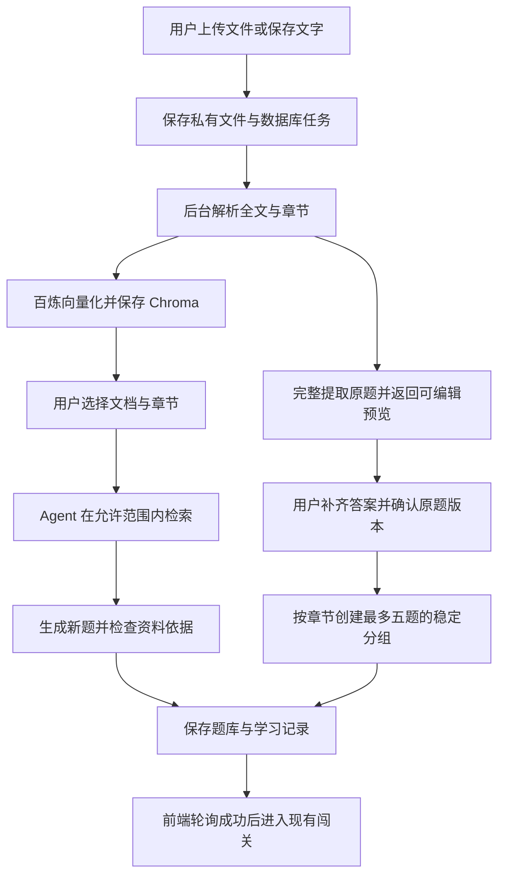

# Design

## Context

动机与用户确认范围见 `proposal.md`。本设计以 2026 年 10 月 4 日读取的代码为基础。

- 后端使用 FastAPI、SQLAlchemy、MySQL 和 Alembic。业务数据与数据库测试继续使用 MySQL。
- `QuizGenerationTask` 已有请求幂等、数据库领取、执行期限和原子保存。前端主要按服务端的 `poll_after_ms=5000` 查询。文档任务可以使用相同模式，但需要独立的表、工作协程与预算。
- 普通出题仍走 `QuizService` 与现有 DeepSeek 结构化输出。Tavily 失败时会使用原 Prompt。本次只为选择了私有资料的请求增加独立路径。
- `QuizDraft` 限制三至五题，普通五题固定为三单选、一多选、一判断。`Question` 限制四个选项和 500 字题干。报告请求限制三至五题。原题导入不能直接套用这些模型。
- 现有前端是 Taro 与 React，首页的文档入口仍为占位提示。`prototypes/03-拓展输入.html` 已有上传、章节预览与私人知识库的视觉基础，但也含本期暂缓功能。
- 本机 `backend/.env` 已有 `BAILIAN_API_MODEL`、`BAILIAN_API_KEY` 和 `BAILIAN_API_BASE_URL`。只读检查确认模型为 `text-embedding-v4`，地址属于北京地域的 DashScope 原生 API 基址。检查没有输出配置值，也没有调用真实服务。
- 当前安装的 LangChain 为 1.4.0，DeepSeek 集成为 1.1.0。已确认本机支持 `create_agent`、模型调用限制和工具调用限制。Chroma 与三个指定文档解析器尚未安装。
- 原有文档有历史范围和实现差异。例如当前普通答题奖励为每题 2 XP、完成额外 10 XP。本次以现有程序行为为回归基线，不顺带修改 XP。

## Goals / Non-Goals

**Goals:**

- 系统让资料管理、索引、按章节出题和原题练习形成完整流程。
- 系统把权限、联网、证据与执行预算交给后端控制。模型不能扩大这些范围。
- 系统在服务故障、处理中断和删除竞态下仍保持真实状态。
- 我们通过先失败、后实现的测试覆盖全部新增后端功能，并保留原有用户与学习行为。

**Non-Goals:**

- 本设计不把全部题库交给向量检索来做原题导入。原题导入需要完整遍历。
- 本设计不实现多服务器共享 Chroma。当前支持单机、单个后端服务进程；同一进程内可以有受限的工作协程。以后扩展多进程时，需要改用独立 Chroma 服务。
- 本设计不提供企业组织、团队共享、OCR、图像题、公式图像识别、网页或视频解析。用户可以上传文字型资料；复杂版式的识别问题进入预览审核。

## Decisions

### 1. 系统按三条业务流程处理输入

| 用户动作 | 数据来源 | 执行方式 | 结果 |
| --- | --- | --- | --- |
| 用户输入普通主题 | 模型与现有可选 Tavily | 现有出题任务 | 现有生成题库 |
| 用户选择知识库文档和章节 | 限定的私有片段与明确允许的公开补充 | 新增 Agentic RAG 路径 | 有资料依据的新题 |
| 用户选择原题导入与练习 | 所选资料的完整文字与用户确认结果 | 完整提取、预览审核、稳定分组 | 原题题库与练习快照 |

原题练习不调用出题模型。文档解析成功后，用户可以直接审核原题，不必等待或依赖向量索引成功。这可以避免百炼故障阻止已经解析的原题资料使用。

我们不把所有输入直接拼入旧 Prompt。那种做法会丢失长文档内容，也无法区分新题生成和原题保留。

### 2. 系统新增独立资料表，并保存不可变版本

我们建议新增以下业务表。所有私人资源都包含当前用户归属，公开编号只用于定位。

| 表 | 用途与重要约束 |
| --- | --- |
| `knowledge_bases` | 系统保存名称、说明、封面标识、用户与删除状态。 |
| `knowledge_documents` | 系统保存类型、文件大小、哈希、当前版本与解析和索引的独立状态。 |
| `knowledge_document_versions` | 系统保存私有存储标识、解析文件、模型维度、切分版本与当前可用索引代次。 |
| `knowledge_chapters` | 系统保存版本、标题、层级、顺序和全文偏移范围。范围不能越界或属于其他文档。 |
| `knowledge_processing_tasks` | 系统保存上传或重试请求、任务类型、阶段、期限、领取令牌、错误和版本。用户与请求编号唯一。 |
| `question_import_drafts` | 系统保存完整提取清单、原文定位、待处理项和递增审核版本。 |
| `question_banks` / `question_bank_items` | 系统保存用户确认的不可变题库版本与原题。每题保留来源题号和原文定位。 |
| `question_practice_groups` | 系统保存题库版本、已排序章节集合、分组序号与对应 Quiz。这个组合唯一。 |

现有 `quizzes` 新增可空资料元信息。现有 `questions` 新增可空逐题依据或原题标识，并把题干与讲解扩展为能保存原题长文本的 MySQL `MEDIUMTEXT`。所有新增字段都提供可空或兼容默认值。旧题库不补造引用。

我们给原题增加独立的审核与学习数据模型。原题模型支持最多 26 个选项和一个以上的有效答案，保留原选项标签；内部判题使用稳定键。普通生成的 `Question`、`QuizDraft` 与匿名旧接口继续保留原限制。题目超出公布的原题限制时，系统拒绝并提示拆分，不截断。

用户修正原题后，系统发布新题库版本。旧分组题目与已完成学习记录保持原样。资料删除会停用题库来源和未进入学习的导入资料；已经持久化的学习题目与有限引用快照按用户确认的规则保留。

### 3. 系统按 LangChain 接口接入百炼原生 API

系统新增 `BailianEmbeddings`，实现 `langchain_core.embeddings.Embeddings` 的同步与异步接口。业务工作协程使用异步调用，并在进入 Chroma 前取得向量。我们使用用户已配置的 DashScope 原生基址，不改成另一种兼容基址，也不复用 DeepSeek 的密钥或地址。

系统向原生基址追加官方文本向量 endpoint。请求使用模型、`input.texts` 和 `parameters`，并设置 `dimension=1024`、`output_type=dense`。底库与查询分别设置 `text_type=document` 和 `text_type=query`。系统按 `text_index` 校验并还原响应顺序，同时检查向量数量、1024 维度与有限数值。每批最多十条文本；片段上限远小于模型单条 8192 Token 限制。（Alibaba Cloud）

系统使用有连接、读取与总时限的 HTTP 客户端。单次默认 15 秒；检索查询默认最多 10 秒。临时超时、429 与 5xx 最多重试一次，并遵守剩余预算和 Retry-After。配置错误、无效密钥、维度错误和非临时配额错误不重试。系统不使用假向量作为业务降级。

我们选择受控原生适配器，因为现有配置使用原生地址，官方原生接口也区分查询与底库文本。直接套用 OpenAI 地址格式会造成请求路径和请求体错误。现有 `DashScopeEmbeddings` 包装器可以参考，但它的全局配置、同步调用与默认重试需要额外控制；本方案不依赖这些隐含行为。

### 4. 系统使用指定解析器，并独立识别章节

| 输入 | 正文读取 | 章节识别 |
| --- | --- | --- |
| PDF | 系统使用 `PyPDFLoader` 的逐页文字模式，不提取图片。 | 系统参考 PDF outline 与正文标题；页号仅用于内部定位，前端不提供页码选择。 |
| DOCX | 系统使用 `Docx2txtLoader` 读取正文。 | 系统使用只读 DOCX 结构与标题样式补充章节位置，正文仍以指定 loader 的结果为基础。 |
| Markdown | 系统使用 `UnstructuredMarkdownLoader`。 | 系统结合标题元素与原 Markdown 标题层级建立章节。 |
| TXT / 粘贴文字 | 系统使用 `TextLoader` 或 LangChain `Document`。 | 系统识别明确的章、节标题；无可靠边界时归入未分章内容。 |

这些 loader 当前来自 `langchain_community.document_loaders`。文档解析 API、PDF outline 和 DOCX 标题样式已经与官方资料核对。（LangChain, “PyPDFLoader”; LangChain, “Docx2txtLoader”; LangChain, “UnstructuredMarkdownLoader”; pypdf; python-docx）

系统统一换行并建立正文偏移映射。页眉、页脚、答案表和未分章内容不会因检索切分而从原文副本中丢失。章节是正文的明确范围，子章节选择会展开为去重后的合法范围。系统不凭标题名称猜测另一篇文档的章节。

用户修正章节时，系统建立新的资料版本与索引代次。新版本只有在完整索引发布后才可用于新题生成。旧版本任务不能静默切换到新章节范围；已经保存的学习快照不受章节修正影响。

解析在独立子进程中运行。系统限制文件大小、解压量、页数、文本量、时间和并发，并在超时时终止子进程。这个方案比仅取消线程更适合处理无法立即取消的文档解析。系统禁止解析器接收用户 URL、自动下载远程内容或加载远程 OCR。Markdown 中的 HTML、图片与链接作为资料处理，不执行或加载。

### 5. Chroma 只发布完成的索引代次

系统使用 `langchain_chroma.Chroma` 与绝对 `persist_directory`。我们为每个用户知识库和固定向量配置建立独立集合，使用 cosine 距离。系统保存文档、章节、用户与索引代次 metadata。检索前先在 MySQL 校验资料范围，再在 Chroma 中强制过滤，并在返回片段后再次核对范围。模型不能传入任意集合或过滤表达式。（LangChain, “Chroma Integration”; Chroma）

系统使用 `RecursiveCharacterTextSplitter`，初始片段为约 1000 字符、重叠约 150 字符，分隔符包含中文标点。系统在章节内切分，不把未选章节带入重叠片段。向量配置指纹包含模型、维度与切分版本；配置变化后必须建立新索引，不混用旧向量。（LangChain, “Splitting Recursively”）

MySQL 与 Chroma 不能共用一个事务。我们采用未发布代次：工作协程写入确定编号的片段，确认数量完整后，短 MySQL 事务检查领取令牌、文档状态和版本，再发布当前索引代次。任何失败都不会让不完整代次参与检索。系统对失效代次执行可重试清理，并在重启时检查中断任务。

Chroma 本机持久化可能使用其内部 SQLite 文件。这不替代项目业务 MySQL，也不把业务测试改为 SQLite。我们不直接修改 Chroma 的内部数据库。私有原文和 Chroma 目录不挂载为 FastAPI 静态资源，也不提交到 Git。

### 6. Agent 只负责受控检索，出题使用真实证据

系统使用本机已验证的 `langchain.agents.create_agent`，继续使用已有 `ChatDeepSeek`。工具只提供当前请求的私有资料检索，以及明确启用后的公开搜索。系统使用 `ModelCallLimitMiddleware` 和 `ToolCallLimitMiddleware`，并保留总截止时间。（LangChain, “Create Agent”; LangChain, “ToolCallLimitMiddleware”）

每次请求的工具绑定当前用户、知识库、文档版本和章节。身份和范围来自服务器，不由模型参数提供。私有请求缺省 `enable_web_search=false`；全局 `ENABLE_WEB_SEARCH=false` 时，服务器不开放公开工具。

联网开关打开后，页面显示单独的公开检索主题。用户可以修改这个主题，提交出题即确认它可以发送给搜索服务。网络工具没有模型可自由填写的查询参数，只使用这份预先确认并过滤的主题。用户上传的原文、原题和私有检索片段不会进入 Tavily 查询。工具继续调用现有 Tavily 服务，保留动态参数、超时、重试、限流和受控日志。

工作协程收集工具实际返回的资料，不把 Agent 自述当作证据。模型按独立的知识库 Prompt 生成题目，并输出逐题证据标识和摘录。服务器校验引用属于本次真实资料、摘录可定位、章节范围正确，并使用受限的答案支持检查。模型遗漏检索、引用虚构、相关性不足或检查不通过时，系统返回 `insufficient_material` 或受控生成错误。系统不调用普通记忆链兜底。

资料只作为不可信事实输入。系统不执行其中的工具指令。公共概念可以使用用户允许的网络资料补充；企业制度、内部流程和原题答案只使用私有或用户确认的依据。公开资料与私有规则冲突时，系统使用私有规则。

Agent 超时或出错时，系统可以使用已验证的私有范围执行一次受控直接检索。只有取得足够真实依据后，系统才继续知识库 Prompt；系统不会因此开放联网或使用模型记忆。网络失败时，系统丢弃网络证据；私有证据充足则继续，否则提示材料不足。

### 7. 原题导入完整遍历，用户确认后发布

原题导入使用完整解析文件，并按题目边界与章节分批处理。系统先用明确格式规则提取题号、选项、答案和讲解。对于不明确的文字版式，系统可以用 DeepSeek 结构化提取辅助定位，但只能返回原文片段与字段位置，不能改写原题或推断缺失答案。服务器验证返回文字确实在来源中。

提取流程有全文覆盖清单和边界重叠去重。系统独立读取集中答案表，按文档、章节和题号关联；重复题号不会仅凭数字覆盖。题干与选项跨片段时，系统合并或提示核对。系统保存已识别、未识别、暂不支持与待补齐项目，不把模型识别数当作文档必然题数。

预览允许用户添加漏识别原题、编辑字段、指定章节、补齐答案和明确排除不支持内容。每次编辑都使用草稿版本，确认操作用唯一请求编号和乐观锁。发布事务会检查所选题目答案合法、原文定位或人工修改记录明确。系统保存原文副本与用户确认版本；人工修改不会伪装成原文。

单选保留一个有效答案。原题多选允许原来源确实给出的一个或多个答案，系统不强行改成普通生成模型要求的至少两个答案。判断答案可以把“对/错”或“√/×”映射成内部 A/B，但系统保留原答案表示。原文没有讲解时，业务模型允许空值，页面显示“原题未提供讲解”。

我们不保证任意复杂文档都能自动识别全部原题。完整导入的含义是系统遍历用户选择的完整文字、保留发现的问题，并让用户核对补齐；系统不会静默裁剪或把缺项包装成成功。

### 8. 原题练习使用稳定分组，保持历史与奖励身份

服务器按所选章节与原顺序形成稳定的五题分组。少于五题的尾组使用真实题量，允许一至四题。首次创建分组时，系统把原题复制为不可变 Quiz 与 Question，并保存原题版本标识和来源快照。相同题库版本、章节集合与分组索引返回同一 Quiz。

首次学习使用现有 normal 规则。用户再次学习同一分组时创建 replay attempt，并继续使用现有按天限制的再次练习奖励。稳定 Question 身份也让错题记录继续关联同一道题。用户仅因重新打开页面不能获得新原题身份。

知识库新题和原题分组的任务成功保存沿用现有短事务。新的任务分发按受校验的来源字段选择普通生成、知识库生成或原题分组。原题分组不要求百炼或出题模型可用。

报告的内部学习请求新增支持一至五题与原题长文本的模型，并为私有新题或原题传入已保存依据。旧匿名报告请求的三至五题限制保持不变。报告重试不重新评分，不修改 XP，不重查已删除资料。错题混合复习继续隐藏未完成引用，并在完成后按题目来源展示快照。

### 9. API 保持统一响应，新增接口独立受保护

以下是计划接口，最终名称可以在不改变规范的前提下做小范围调整。

| 接口 | 用途 |
| --- | --- |
| `GET /api/v1/knowledge-bases/capabilities` | 系统返回功能可用状态、文件类型与实际限制，不返回密钥或内部地址。 |
| `GET/POST /api/v1/knowledge-bases` | 用户列出或新建知识库。 |
| `GET/PATCH/DELETE /api/v1/knowledge-bases/{id}` | 用户查看、修改或删除自己的知识库。 |
| `GET/POST /api/v1/knowledge-bases/{id}/documents` | 用户列出或上传私有文档；保存完成后返回 202。 |
| `POST /api/v1/knowledge-bases/{id}/text-documents` | 用户保存文字资料并取得处理任务。 |
| `GET/DELETE /api/v1/knowledge-documents/{id}` | 用户查看状态或删除资料。 |
| `GET /api/v1/knowledge-documents/{id}/preview` | 用户分页读取文字与章节预览。 |
| `PATCH /api/v1/knowledge-documents/{id}/chapters` | 用户确认或修正章节，提交当前版本。 |
| `POST /api/v1/knowledge-documents/{id}/processing-tasks` | 用户重试失败解析或索引。 |
| `GET /api/v1/knowledge-processing-tasks/{id}` | 用户查询阶段、状态和安全错误。 |
| `POST /api/v1/knowledge-documents/{id}/question-import-tasks` | 用户选择章节并启动完整原题提取。 |
| `GET/PATCH /api/v1/question-imports/{id}` | 用户分页审核、添加与修改原题草稿。 |
| `POST /api/v1/question-imports/{id}/confirm` | 用户确认题库版本；服务器原子发布。 |
| `GET /api/v1/question-banks/{id}` | 用户查看已确认的原题与章节分组。 |
| `POST /api/v1/question-banks/{id}/practice-tasks` | 用户提交幂等原题分组练习任务。 |
| `POST /api/v1/quizzes/generation-tasks` | 用户增加可选知识库、文档版本与章节字段；旧字段缺省仍走原有出题。 |

所有知识库、文档、原题与任务接口需要登录，查询条件同时限制 ID 和当前用户。列表与预览分页，编辑请求有限长度。原有 CORS 方法需要增加 DELETE，现有 GET、POST、PATCH 的含义保持不变。

### 10. 前端沿用原型并明确管理与学习状态

我们调整 `prototypes/03-拓展输入.html`，删除本期暂缓的入口和承诺，并补充原题审核与资料管理状态。正式前端开发前需要用户确认新增页面原型；后端独立功能可以继续执行 TDD。

| 页面 | 页面内容 |
| --- | --- |
| 我的知识库 | 页面展示当前用户的知识库、资料数量、新建和修改入口。 |
| 知识库详情 | 页面展示文档、实际解析与索引状态、上传、文字导入、失败重试和删除入口。 |
| 资料预览与章节 | 页面展示原文片段、章节层级和未分章内容，并允许选择全文或章节。 |
| 处理状态 | 页面展示真实阶段、已处理数量和任务结果，不使用假的百分比、剩余时间或微信通知承诺。 |
| 原题审核 | 页面展示完整题干、全部选项、答案、讲解、章节、原文定位和待处理项，并提供编辑与确认。 |
| 学习准备 | 页面区分“根据资料生成新题”和“练习已确认原题”，展示章节范围与原题分组。知识库新题的联网默认关闭。 |

微信端使用 `Taro.chooseMessageFile` 选择文档，并使用 `Taro.uploadFile` 上传。H5 需要独立的文件选择适配，因为前者只支持微信小程序。上传请求需要认证刷新、超时、取消与幂等恢复，不能直接照搬现有简化头像上传方法。（Taro, “ChooseMessageFile”; Taro, “UploadFile”）

系统保留现有任务请求控制方式，增加来源范围与当前用户标识。页面隐藏会暂停查询，不取消已接收的后台任务。用户回来后从服务器恢复任务；账号切换不能恢复上一位用户的任务。提交按钮会防重复操作，成功后才进入现有答题页。原题预览属于资料管理，可以显示答案；练习 API 仍按答题状态隐藏答案。

### 11. 新功能使用独立开关、限额和预算

| 配置 | 初始值或行为 |
| --- | --- |
| `ENABLE_KNOWLEDGE_BASE` | 系统提供独立开关；开发完成并验证后启用。关闭时不启动新服务或工作协程。 |
| `BAILIAN_API_MODEL` | 系统使用用户已有的 `text-embedding-v4`。 |
| `BAILIAN_API_KEY` | 系统以 SecretStr 读取，不输出或复制到文档。 |
| `BAILIAN_API_BASE_URL` | 系统读取用户已有的北京地域原生基址，校验 HTTPS 和允许的提供商地址，不自动改写地域。 |
| `KNOWLEDGE_STORAGE_DIRECTORY` | 系统默认使用 `backend/data/knowledge` 下的私有原文件和解析文件。 |
| `CHROMA_PERSIST_DIRECTORY` | 系统默认使用 `backend/data/chroma` 的绝对路径。 |
| 上传限制 | 系统默认每文件 30 MiB；页面按 30 MB 展示。每用户最多 10 个库、200 份未删除资料、300 MiB 原文件总量。限额均可配置。 |
| 解析限制 | 系统默认最多 500 页、50 万字符、1000 个向量片段；超限明确拒绝，不裁剪。单次解析最多 60 秒，并发 1。 |
| 原题限制 | 系统默认每次最多 1000 题，每题题干与讲解各最多 32000 字符，每个选项最多 8000 字符，最多 26 个选项。系统公开实际限制。 |
| 批量索引任务 | 系统默认总预算 600 秒，分批写入并更新阶段；执行期限覆盖该预算并有安全余量。 |
| 原题提取任务 | 系统默认总预算 600 秒；读取与提取批次受限。超时不发布部分完成的题库。 |
| 知识库新题任务 | 系统默认总预算 180 秒；普通出题继续使用原有预算。检索与规划需要为生成和证据检查预留时间。 |
| Agent 限额 | 系统默认最多三次模型规划调用、四次工具调用和 45 秒检索规划预算；所有重试计入限制。 |
| 查询轮询 | 新资料任务默认 `poll_after_ms=5000`。系统在上次查询结束后再等待五秒，不叠加请求。 |

能力接口按操作报告可用状态。百炼未配置或暂时不可用时，系统停用索引和依赖索引的新题生成；文件管理、已解析原题审核和已确认原题练习仍按各自依赖工作。界面不会把向量故障误显示为整个知识库功能不可用。

这些技术限额是本版建议默认值。它们避免单机文档处理抢占现有学习服务，后续可以依据实际样本调整。我们不改变用户确认的文件范围、题型、章节选择和历史保留规则。

### 12. 我们对新增后端功能执行 TDD

每个后端模块都先写失败测试，确认失败原因对应缺失行为，再写最小实现并重构。验收记录保存每阶段的红、绿测试命令与结果。自动测试不读取本机真实密钥；百炼、DeepSeek 与 Tavily 使用受控 HTTP 或模型替身，业务数据库使用独立 MySQL 测试库，Chroma 使用测试临时持久化目录。

我们至少覆盖以下行为：

- 权限测试覆盖知识库、原文、章节、任务、草稿、题库和检索；两个用户使用相同主题仍不能互相读取。
- 上传测试覆盖格式与内容检查、30 MB 边界、大小流式限制、ZIP 解压量、路径越界、空文件、加密 PDF、扫描件与解析超时。
- 解析测试使用真实的小 PDF、DOCX、Markdown 与 TXT 固定样本，覆盖中文标题、正文未分章、表格文字、集中答案表与跨片段题目。
- 百炼测试检查实际路径、请求体、查询与底库类型、十条分批、响应乱序、缺项、非有限数值、维度、超时、429、5xx、预算、取消与无密钥日志。
- 索引测试使用真实 Chroma，覆盖重开持久化目录、权限过滤、章节重叠去重、版本不混用、部分失败、删除清理与迟到工作协程。
- Agent 测试覆盖工具选择、缺省禁网、后端强制关闭、公开主题固定、私有片段不进入查询、注入指令、次数限制、故障降级与依据不足拒绝。
- 原题测试覆盖三种题型、长题干、五个以上选项、没有讲解、缺失与冲突答案、重复题号、完整遍历、草稿编辑冲突、原文匹配、用户确认与幂等发布。
- 学习测试覆盖一至五题原题分组、稳定 Quiz 身份、再次练习奖励、错题复习、报告、未作答隐藏答案和完成后引用，以及更新或删除资料后的历史。
- 迁移测试检查已有数据保留、空库升级、重复升级、SQL 快照一致、兼容新旧代码和回滚限制。整体覆盖率保持不低于项目要求的 90%。

前端测试覆盖选文件、上传认证、章节勾选、草稿编辑、缺答案提示、五秒轮询、账号隔离、暂停与恢复、重复点击和成功跳转。我们执行微信小程序与 H5 的类型检查和构建，并通过端到端流程检查资料上传、原题确认、生成、答题、历史和删除。真实微信选文件与上传仍需要开发者工具或真机验证，构建通过不能代替这个结果。

## Risks / Trade-offs

- [自动提取漏题或错配] → 系统完整遍历、保留覆盖清单与集中答案关联问题，用户通过可编辑预览补齐。系统不声称任意版式可以自动无损导入。
- [文字型表格或 PDF 版式损失] → 系统保留原文件与正文定位，检测复杂内容并提示核对。图片依赖题目不进入可练习题库。
- [资料或网页注入指令] → 工具范围由服务器绑定，资料不拥有执行权限，引用只能来自真实工具结果。模型支持检查仍可能误判，页面提供人工核对依据。
- [私有内容发送给外部模型] → 百炼会接收需要向量化的文字，DeepSeek 会接收检索片段或待提取原题。页面说明这一用途；Tavily 只收到明确确认的公开主题。默认关闭追踪正文与自动遥测。
- [MySQL 与 Chroma 状态分离] → 系统采用未发布索引代次、发布前检查与可重试清理。运维备份需要同时覆盖 MySQL、原文件和 Chroma 目录。
- [解析或向量化抢占资源] → 系统使用独立工作协程、子进程解析、明确限额与总预算，并避免模型调用期间占用数据库连接。
- [相似度分数误当可信度] → 系统按集合实际 cosine 距离解释返回分数，使用固定样本调阈值。分数只用于候选筛选，不作为答案正确率。
- [单机持久化限制] → 本期固定单服务进程和本机备份。多进程或多服务器需要迁移到 Chroma 服务端，不能直接共享本机目录。
- [扩展存储后的降级风险] → 新字段可空，长文本字段不会在回滚时自动收窄。我们优先关闭功能并保留数据，不破坏旧题目与学习记录。

## Migration Plan

1. 我们先执行原有测试并保存基线；我们在独立 MySQL 测试库完成所有新增功能的 TDD。
2. 我们安装并锁定新增依赖，保持现有 LangChain 与 DeepSeek 版本。解析器依赖需要验证 Windows 与 Python 3.13 可用，并提前准备必要本地资源，业务请求不能自动下载。
3. 我们添加递增 Alembic 迁移、增量 SQL 和完整 SQL 快照。测试确认原用户、题库、答案、任务与历史保留后，再对开发库执行升级。
4. 我们准备私有文件与 Chroma 目录，确认权限、磁盘空间和 Git 忽略；我们不改写用户的百炼、Tavily 或 DeepSeek 密钥。
5. 我们完成扩展输入原型确认，再接入知识库、章节、原题审核和学习入口。新入口按后端功能状态展示。
6. 我们使用不含私人信息的固定样本验证真实百炼向量化、DeepSeek 工具调用、私有资料出题与原题学习。验证记录不包含密钥或真实私有资料。
7. 我们执行现有完整回归、前端测试、类型检查与双端构建，并验证后端正常启动、任务恢复和删除清理。
8. 我们启用新功能并保存验收记录。回滚时先关闭知识库入口与新任务领取，保留数据库扩展和已有快照。旧学习继续工作。结构回滚只有在确认没有新功能数据需要保留后才执行，不能自动删除资料或收窄长字段。

## 参考资料（MLA）

以下资料访问日期为 4 Oct. 2026。我们只使用官方文档与官方源码；本次没有可用的 Context7 工具。

Alibaba Cloud. “同步接口API详情.” *阿里云帮助中心*, https://help.aliyun.com/zh/model-studio/text-embedding-synchronous-api/. Accessed 4 Oct. 2026.

LangChain. “Create Agent.” *LangChain Reference*, https://reference.langchain.com/python/langchain/agents/factory/create_agent. Accessed 4 Oct. 2026. 我们另行读取本机 1.4.0 接口签名，核对了已安装版本。

LangChain. “ToolCallLimitMiddleware.” *LangChain Reference*, https://reference.langchain.com/python/langchain/agents/middleware/tool_call_limit/ToolCallLimitMiddleware. Accessed 4 Oct. 2026.

LangChain. “Chroma Integration.” *Docs by LangChain*, https://docs.langchain.com/oss/python/integrations/vectorstores/chroma. Accessed 4 Oct. 2026.

LangChain. “Splitting Recursively.” *Docs by LangChain*, https://docs.langchain.com/oss/python/integrations/splitters/recursive_text_splitter. Accessed 4 Oct. 2026.

LangChain. “PyPDFLoader.” *langchain-community*, https://github.com/langchain-ai/langchain-community/blob/main/libs/community/langchain_community/document_loaders/pdf.py. Accessed 4 Oct. 2026.

LangChain. “Docx2txtLoader.” *langchain-community*, https://github.com/langchain-ai/langchain-community/blob/main/libs/community/langchain_community/document_loaders/word_document.py. Accessed 4 Oct. 2026.

LangChain. “UnstructuredMarkdownLoader.” *langchain-community*, https://github.com/langchain-ai/langchain-community/blob/main/libs/community/langchain_community/document_loaders/markdown.py. Accessed 4 Oct. 2026.

Chroma. “Metadata Filtering.” *Chroma Docs*, https://docs.trychroma.com/docs/querying-collections/metadata-filtering. Accessed 4 Oct. 2026.

pypdf. “Handling Outlines.” *pypdf Documentation*, https://pypdf.readthedocs.io/en/stable/user/handling-outlines.html. Accessed 4 Oct. 2026.

python-docx. “Working with Styles.” *python-docx Documentation*, https://python-docx.readthedocs.io/en/stable/user/styles-using.html. Accessed 4 Oct. 2026.

Taro. “Taro.chooseMessageFile(option).” *Taro 文档*, https://docs.taro.zone/en/docs/apis/media/image/chooseMessageFile. Accessed 4 Oct. 2026.

Taro. “Taro.uploadFile(option).” *Taro 文档*, https://docs.taro.zone/docs/apis/network/upload/uploadFile. Accessed 4 Oct. 2026.
